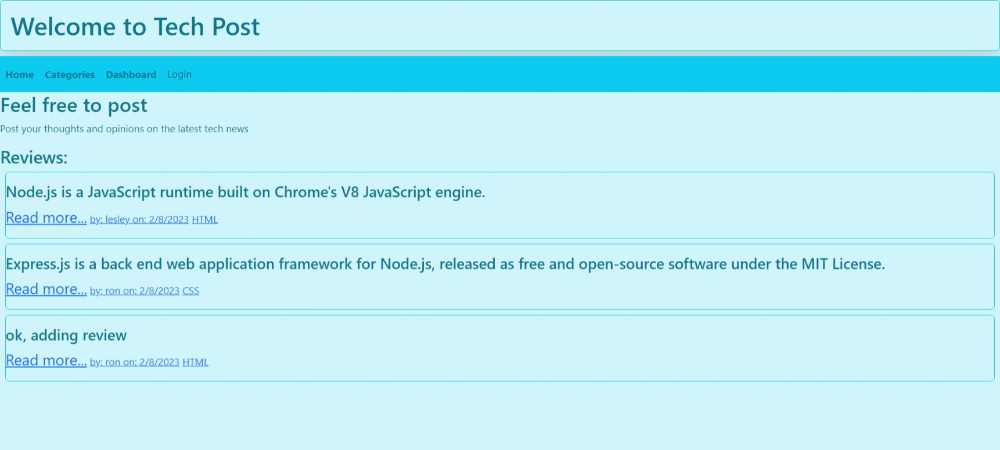

# Byte-Writer

## Description
This is a tech blog that allows users to create an account and post their thoughts on the latest tech news. Users can also comment on other users' posts.
## Table of Contents

- [Description](#description)
- [Installation](#installation)
- [Usage](#usage)
- [Website](#website)
- [Screenshot](#screenshot)
- [Testing](#testing)
- [License](#license)
- [Contributing](#contributing)
- [Questions](#questions)
- [Credits](#credits)

## Installation
run `npm i` to install dependencies and set up a .env file with your database credentials.
## Usage
Run npm start to start the server and navigate to localhost:3001 to view the site.
## Website  
[Deployed Site](https://intense-brushlands-19186.herokuapp.com)
## Screenshot

## Testing
There is no testing suite for this project.
## License
MIT License

## Contributing

There are no guidelines for contributing to this project. Feel free to fork the repo and make any changes you'd like.
## Questions
If you have any questions about this project, please contact me.

## Credits
I would like to thank my tutor, my TA, and my classmates for their help and support.